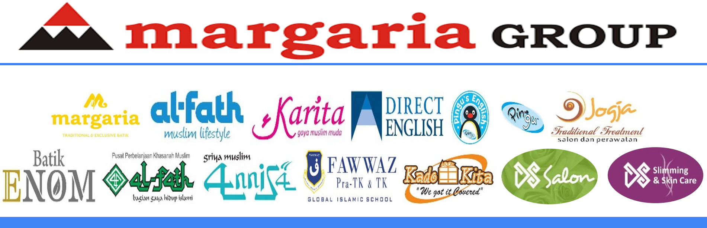
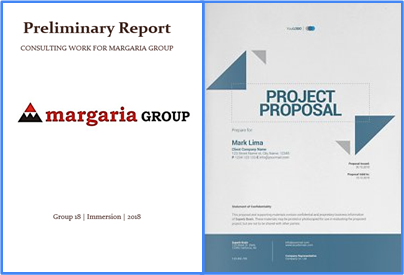
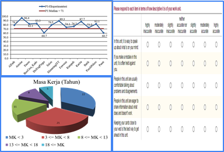
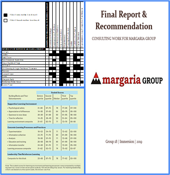

# Immersion

## Introduction

The program is an immersive work in which we conducted consulting work for Margaria Group under the supervision of MMUGM Yogyakarta. The team is assigned in 12 Business Units of Margaria Group. i.e.: Margaria Batik, Al-Fath Muslim Style, Karita, Direct English, Pingu's English, Jogja Traditional Treatment, Annisa Griya Muslim, Fawwaz School, Kado Kita, DS Slimming & Skin Care, as well as DS Salon.

## Role

1. Conducted analysis on company’s vision and mission statement and how its implementation, analyzed competitive environment using the Five Forces framework, as well as conducted measurement for the  implementation level of learning organization in company business units using the Learning Organization  framework.
2. Presenting results and findings in Exposure Phase of Immersion Program, as well as providing benchmark and potential collaborative mapping / matrix among business units, as the basis for providing recommendation for  company’s director.

## Workflow & Deliveries

| Phase | Details | Deliveries | - |
| ------ | ------ | ------| ------ |
| IP1 - Initiation | Preliminary observation, planning, and program proposal | Preliminary Report, Project Proposal |  |
| IP2 - Experiencing | Observation, data gathering | surveys, documentation, interviews, discussion, measurement, analysis, conclusion |  |
| IP3 - Exposing | Presenting results, findings, providing recommendation | Collaboration Matrix, Benchmark, Final Report, Recommendation |  |

## Results

Details on the FInal Report is restricted to certain purpose based on request
